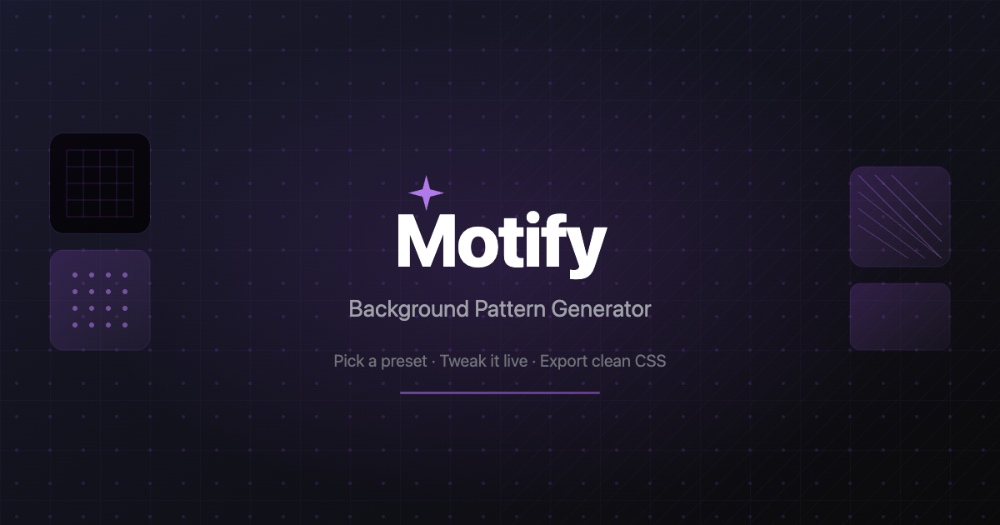

# Motify

An interactive, open-source CSS background pattern generator. Pick a preset, tweak it live, and export clean CSS or JSX code.

**[Live Demo](https://motify.achour.dev)** · **[Read the Article](https://www.achour.dev/projects/motify/)**



## Features

- **Preset Gallery** — 9 professionally designed patterns including Neon Grid, Dot Matrix, Ocean Waves, Zigzag Sunset, Blueprint, and Carbon Fiber
- **Real-Time Editor** — Split-screen interface with instant visual feedback as you tweak parameters
- **Layered Pattern Engine** — Compose patterns from three independent layer types:
  - **Base** — Solid color, linear, or radial gradient
  - **Motif** — Repeating geometric pattern (grid, dots, waves, zigzag, crosshatch)
  - **Modifiers** — Optional overlays like vignette and fade
- **Fine-Grained Controls** — Adjust colors, opacity, scale, spacing, stroke weight, angle, and gradient direction
- **Multi-Format Export** — Copy as CSS properties or JSX inline style objects

## Tech Stack

- [TanStack Start](https://tanstack.com/start) (React 19)
- [Tailwind CSS v4](https://tailwindcss.com/)
- [shadcn/ui](https://ui.shadcn.com/) (base-nova style with `@base-ui/react`)
- TypeScript
- Vite
- Deployed on [Vercel](https://vercel.com)

## Getting Started

```bash
# Clone the repo
git clone https://github.com/Achour/motify.git
cd motify

# Install dependencies
pnpm install

# Start dev server
pnpm dev
```

The app will be running at `http://localhost:3000`.

## Scripts

| Command | Description |
| --- | --- |
| `pnpm dev` | Start development server |
| `pnpm build` | Production build |
| `pnpm preview` | Preview production build locally |
| `pnpm test` | Run tests with Vitest |

## Contributing

Contributions are welcome! Feel free to open an issue or submit a pull request.

## License

Open source — see the repository for license details.
